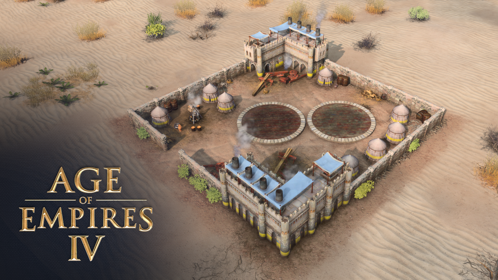

# AoE4 Mod: Superweapon (PvP)

[Get it on Age Mods](https://www.ageofempires.com/mods/details/310437/)

Add Siege Camp in campaign as a superweapon for the game.

The Siege Camp is available at Imperial Age for 2000 wood, 2000 gold and 2000 stone. It comes with the Thunderous Barrage ability with a cost of 1000 stone and a cooldown of 150 seconds. Each player may build at most one Siege Camp.

See also the original PvE version at [zhanghai/aoe4-mod-superweapon](https://github.com/zhanghai/aoe4-mod-superweapon).

## License

    Copyright (C) 2024 Hai Zhang

    This program is free software: you can redistribute it and/or modify
    it under the terms of the GNU General Public License as published by
    the Free Software Foundation, either version 3 of the License, or
    (at your option) any later version.

    This program is distributed in the hope that it will be useful,
    but WITHOUT ANY WARRANTY; without even the implied warranty of
    MERCHANTABILITY or FITNESS FOR A PARTICULAR PURPOSE.  See the
    GNU General Public License for more details.

    You should have received a copy of the GNU General Public License
    along with this program.  If not, see <https://www.gnu.org/licenses/>.
